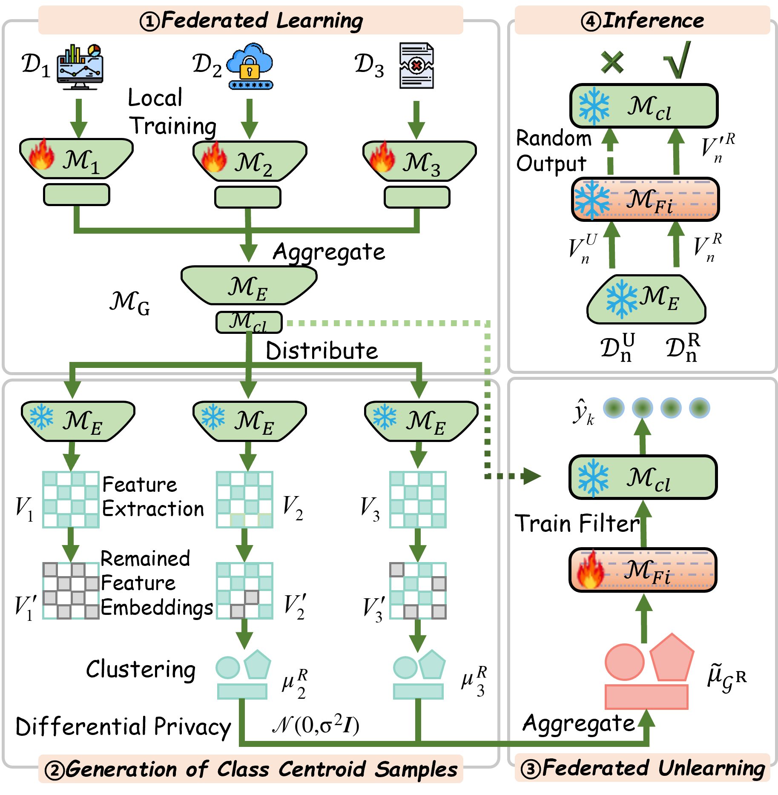

# FedUP: One-Shot Federated Unlearning via Centroid-Guided Plug-in Filters




## Overview

We propose FedUP, a one-shot federated unlearning framework utilizing lightweight pluggable filters that act as a ``knowledge funnel" to screen out target data while preserving original model performance.

## Dependencies

```
torch==2.3.1
torchvision==0.18.1
numpy==1.24.3
scikit-learn==1.3.2
pandas==2.0.2
transformers==4.42.3
```

## Datasets

### Image Datasets
-[MNIST](http://yann.lecun.com/exdb/mnist/)
-[Cifar10](https://www.cs.toronto.edu/~kriz/cifar.html)  
-[Cifar100](https://www.cs.toronto.edu/~kriz/cifar.html)  


### Text Datasets
-[AG News](https://huggingface.co/datasets/ag_news)

## Quick start

```bash
python main.py --data_name='cifar10' --forget_paradigm='client' --paradigm='adapter' --global_epoch=50 --local_epoch=5
```

